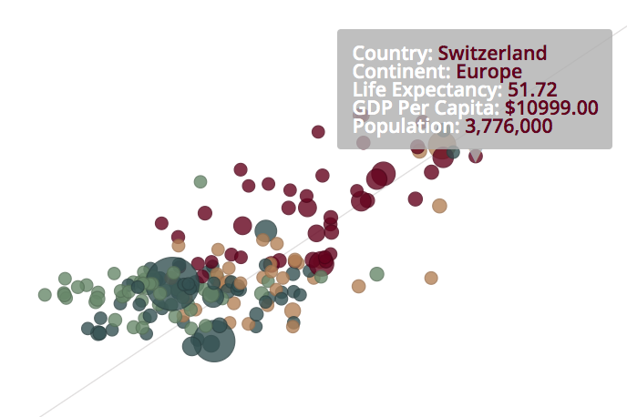

# [LifeExp-vs-GDP](https://fion-p.github.io/Distributions/)

Distributions is an interactive data visualization based off of Hans Rosling's TED talk on the correlation between income and lifespan. The dataset is parsed from gapminder and is used to create this visualization where users are allowed to change the countries, change the regions, and change the years. The bubbles represent each country, with the size determined by the population for that year and the color determined by the country's region. 


# Technologies Used
  * D3.js to create the visuals
  * Vanilla javascript to create dynamic features
  * HTML5 to display the visuals
  * CSS3 to style the contents
 
# Feature Highlights

## D3 Tips and Date Slider
<!--  -->

  * D3 tips are used so that users can see the information.
  * The tips are shown when the mouse hovers over the bubble.
  * Tips don't appear unless the mouse is on the bubble so that the data does not get congested.

## Selectors and Checkboxes


  * Selectors are used to let users change the region displayed. 
  * The bubbles are switched on change and can be changed while playing and while not playing. 
  * Checkboxes allow users to specify which countries to look at. 
  * The bubbles are filtered on click and upon check labels are appended to the graph. 


## Date Slider 

  ```javascript
    let rangeslider = document.getElementById("sliderRange");
    let output = document.getElementById("demo");

    output.innerHTML = rangeslider.value;

    export const sliderListener = data => {

    rangeslider.addEventListener('input', () => {
        clearInterval(interval);
        playButton.textContent = "Play";
        output.innerHTML = rangeslider.value;
        i = rangeslider.value - 1800;
        update(data[i], i);
      });
      
      rangeslider.addEventListener('click', () => {
        clearInterval(interval);
        playButton.textContent = "Play";
        update(data[i], i);
      });
    };
  ```
  * A slider is use to allow users to go to unique years in the visualization. 
  * The first event listener is used so that the the data changes when the user drags slider
  * The second event listener is used so that the visual stops playing once the user clicks on the bar.

